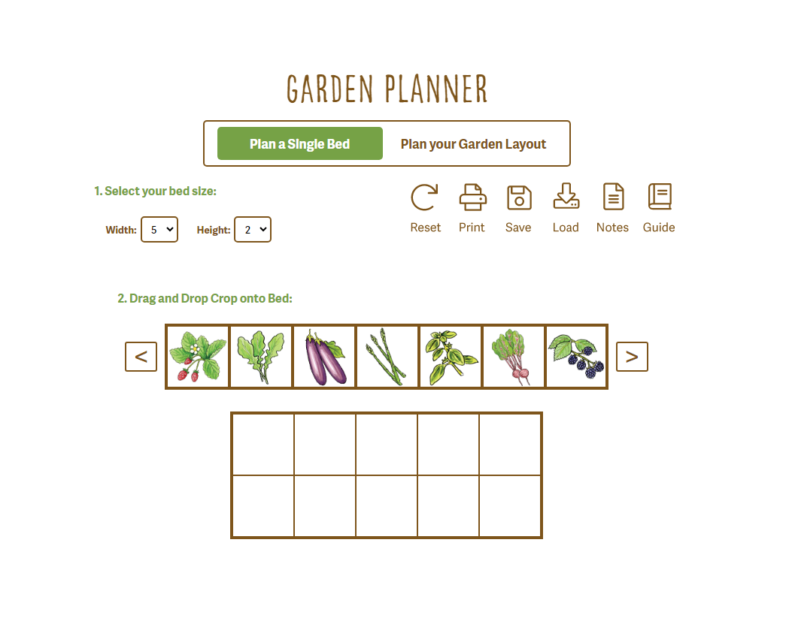

 

  

  <h3 align="center">Kitchen Garden Planner</h3>

  

    A web app created for gardeners.com
     
     
  

## About The Project

 

    </img>

 

There are many great README templates available on GitHub; however, I didn't find one that really suited my needs so I created this enhanced one. I want to create a README template so amazing that it'll be the last one you ever need -- I think this is it.

Here's why:
* Your time should be focused on creating something amazing. A project that solves a problem and helps others
* You shouldn't be doing the same tasks over and over like creating a README from scratch
* You should implement DRY principles to the rest of your life :smile:

Of course, no one template will serve all projects since your needs may be different. So I'll be adding more in the near future. You may also suggest changes by forking this repo and creating a pull request or opening an issue. Thanks to all the people have contributed to expanding this template!

Use the `BLANK_README.md` to get started.

(<a href="#readme-top">back to top</a>)

### Built With

* [![React][React.js]][React-url]
* [![Node][Node.js]][Node-url]
* [![Express][Express.js]][Express-url]
* [![Azure-DevOps]][Azure-Devops-url]

(<a href="#readme-top">back to top</a>)

<!-- USAGE EXAMPLES -->
## Demo

You can view the project live [here](https://www.gardeners.com/how-to/garden-planner/garden-designer.html). It aims to assist users in planning their beds and gardens. 

_Other garden planning resources provided by [gardeners.com](https://www.gardeners.com)_
- [Pre-Planned Gardens](https://www.gardeners.com/kitchen-garden-planner/preplanned-gardens)
- [Vegetable Encyclopedia](https://www.gardeners.com/gardening-encyclopedia)
- [Soil Calculator](https://www.gardeners.com/how-to/soil-calculator/7558.html)
- [Pest & Disease Directory](https://www.gardeners.com/how-to/pest-and-disease-directory/5285.html)
- [Zone Finder](https://www.gardeners.com/how-to/new-hardiness-map/7887.html)
- [Rainfall Calculator](https://www.gardeners.com/how-to/rain-barrel-for-rainwater-collection/5497.html)

(<a href="#readme-top">back to top</a>)

<!-- LICENSE -->
## License

This project is not distributed under a license. It was created for [gardeners.com](https://www.gardeners.com), and no one has permission to copy, distribute, or modify the project under any circumstances.

(<a href="#readme-top">back to top</a>)

<!-- CONTACT -->
## Contact

Mail - me@directedbyshawn.com

Website - [directedbyshawn.com](https://www.directedbyshawn.com)

LinkedIn - [linkedin.com/in/directedbyshawn](https://www.linkedin.com/in/directedbyshawn)

(<a href="#readme-top">back to top</a>)

<!-- ACKNOWLEDGMENTS -->
## Acknowledgments

Use this space to list resources you find helpful and would like to give credit to. I've included a few of my favorites to kick things off!

* [Choose an Open Source License](https://choosealicense.com)
* [GitHub Emoji Cheat Sheet](https://www.webpagefx.com/tools/emoji-cheat-sheet)
* [Malven's Flexbox Cheatsheet](https://flexbox.malven.co/)
* [Malven's Grid Cheatsheet](https://grid.malven.co/)
* [Img Shields](https://shields.io)
* [GitHub Pages](https://pages.github.com)
* [Font Awesome](https://fontawesome.com)
* [React Icons](https://react-icons.github.io/react-icons/search)

(<a href="#readme-top">back to top</a>)

<!-- MARKDOWN LINKS & IMAGES -->
<!-- https://www.markdownguide.org/basic-syntax/#reference-style-links -->
[contributors-shield]: https://img.shields.io/github/contributors/othneildrew/Best-README-Template.svg?style=for-the-badge
[contributors-url]: https://github.com/othneildrew/Best-README-Template/graphs/contributors
[forks-shield]: https://img.shields.io/github/forks/othneildrew/Best-README-Template.svg?style=for-the-badge
[forks-url]: https://github.com/othneildrew/Best-README-Template/network/members
[stars-shield]: https://img.shields.io/github/stars/othneildrew/Best-README-Template.svg?style=for-the-badge
[stars-url]: https://github.com/othneildrew/Best-README-Template/stargazers
[issues-shield]: https://img.shields.io/github/issues/othneildrew/Best-README-Template.svg?style=for-the-badge
[issues-url]: https://github.com/othneildrew/Best-README-Template/issues
[license-shield]: https://img.shields.io/github/license/othneildrew/Best-README-Template.svg?style=for-the-badge
[license-url]: https://github.com/othneildrew/Best-README-Template/blob/master/LICENSE.txt
[linkedin-shield]: https://img.shields.io/badge/-LinkedIn-black.svg?style=for-the-badge&logo=linkedin&colorB=555
[linkedin-url]: https://linkedin.com/in/othneildrew
[React.js]: https://img.shields.io/badge/React-20232A?style=for-the-badge&logo=react&logoColor=61DAFB
[React-url]: https://reactjs.org/
[Node.js]: https://img.shields.io/badge/Node.js-43853D?style=for-the-badge&logo=node.js&logoColor=61DAFB
[Node-url]: https://nodejs.org/en
[Express.js]: https://img.shields.io/badge/Express.js-404D59?style=for-the-badge
[Express-url]: https://expressjs.com/
[Azure-DevOps]: https://img.shields.io/badge/Azure_DevOps-0078D7?style=for-the-badge&logo=azure-devops&logoColor=white
[Azure-DevOps-url]: https://azure.microsoft.com/en-us/products/devops
