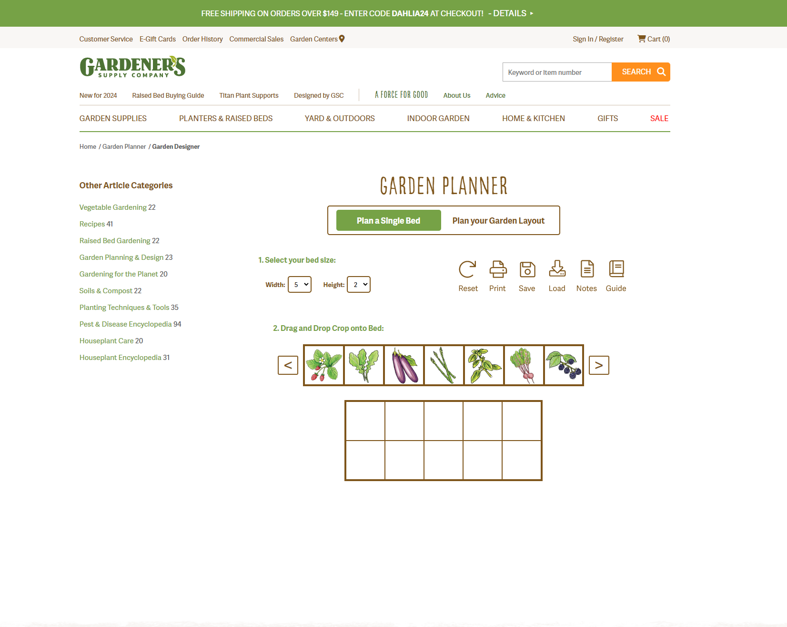

 

  

  <h3 align="center">Garden Planner</h3>

  

    A web app created for <a href="https://www.gardeners.com">gardeners.com</a>
     
     
  

<h2>About the Project</h2>

 

    </img>

 

During my 10 week internship with [gardeners.com](https://www.gardeners.com), I created this full stack web app from scratch. The front-end was built using *React*, paired with an *Express* back-end running on *Node*. Stored and managed data in Azure’s *CosmosDB*. Constructed a pipeline in *YAML* to build and deploy the application from a *DevOps repository* to an *Azure Web App*. 

This was a solo project, so I was responsible for
* Requirements gathering
* UI & UX design
* Front-end development
* Back-end development
* Database design
* Deployment

This was a very challenging project for me. Since it was a solo project from scratch, they allowed me to use any stack as long as it could run as an Azure Web App. Seeing as I had never done a larger scale web development project before, I choose a very popular stack as I knew there would be plenty of online resources to guide me. Learning all of these new technologies on my own while trying to complete this project in under 10 weeks was stressful, but overall I'm incredibly grateful for the experience. I learned a ton, and I had a great summer working at Gardeners.

### Built With

* [![React][React.js]][React-url]
* [![Node][Node.js]][Node-url]
* [![Express][Express.js]][Express-url]
* [![Azure-DevOps]][Azure-Devops-url]

(<a href="#readme-top">back to top</a>)

<!-- USAGE EXAMPLES -->
## Demo

You can view the project live [here](https://www.gardeners.com/how-to/garden-planner/garden-designer.html). It aims to assist users in planning their beds and gardens. 

_Other garden planning resources provided by [gardeners.com](https://www.gardeners.com)_
- [Pre-Planned Gardens](https://www.gardeners.com/kitchen-garden-planner/preplanned-gardens)
- [Vegetable Encyclopedia](https://www.gardeners.com/gardening-encyclopedia)
- [Soil Calculator](https://www.gardeners.com/how-to/soil-calculator/7558.html)
- [Pest & Disease Directory](https://www.gardeners.com/how-to/pest-and-disease-directory/5285.html)
- [Zone Finder](https://www.gardeners.com/how-to/new-hardiness-map/7887.html)
- [Rainfall Calculator](https://www.gardeners.com/how-to/rain-barrel-for-rainwater-collection/5497.html)

(<a href="#readme-top">back to top</a>)

<!-- LICENSE -->
## License

This project is not distributed under a license. It was created for [gardeners.com](https://www.gardeners.com), and no one has permission to copy, distribute, or modify the project under any circumstances.

(<a href="#readme-top">back to top</a>)

<!-- CONTACT -->
## Contact

Mail - me@directedbyshawn.com

Website - [directedbyshawn.com](https://www.directedbyshawn.com)

LinkedIn - [linkedin.com/in/directedbyshawn](https://www.linkedin.com/in/directedbyshawn)

(<a href="#readme-top">back to top</a>)

<!-- ACKNOWLEDGMENTS -->
## Dependencies

Resources that made this project possible.

* [fbemitter](https://www.npmjs.com/package/fbemitter)
* [mathjs](https://mathjs.org/)
* [react-beautiful-dnd](https://github.com/atlassian/react-beautiful-dnd)
* [react-loader-spinner](https://www.npmjs.com/package/react-loader-spinner)
* [react-router](https://reactrouter.com/en/main)
* [reactjs-popup](https://www.npmjs.com/package/reactjs-popup)
* [styled-componenets](https://styled-components.com/)
* [cors](https://www.npmjs.com/package/cors)
* [dotenv](https://www.npmjs.com/package/dotenv)
* [mongodb](https://www.mongodb.com/)
* [cosmosdb](https://azure.microsoft.com/en-us/products/cosmos-db#:~:text=Azure%20Cosmos%20DB%20for%20NoSQL%20is%20a%20native%20non%2Drelational,language%20designed%20for%20JSON%20data.)
* [mongoose](https://mongoosejs.com/)

(<a href="#readme-top">back to top</a>)

## Notes
* While I did create this project, it is no longer managed by me. I have no access to the codebase, and changes you see on the site done after August 2022 were not made by me. 

(<a href="#readme-top">back to top</a>)

<!-- MARKDOWN LINKS & IMAGES -->
<!-- https://www.markdownguide.org/basic-syntax/#reference-style-links -->
[linkedin-shield]: https://img.shields.io/badge/-LinkedIn-black.svg?style=for-the-badge&logo=linkedin&colorB=555
[linkedin-url]: https://linkedin.com/in/othneildrew
[React.js]: https://img.shields.io/badge/React-20232A?style=for-the-badge&logo=react&logoColor=61DAFB
[React-url]: https://reactjs.org/
[Node.js]: https://img.shields.io/badge/Node.js-43853D?style=for-the-badge&logo=node.js&logoColor=61DAFB
[Node-url]: https://nodejs.org/en
[Express.js]: https://img.shields.io/badge/Express.js-404D59?style=for-the-badge
[Express-url]: https://expressjs.com/
[Azure-DevOps]: https://img.shields.io/badge/Azure_DevOps-0078D7?style=for-the-badge&logo=azure-devops&logoColor=white
[Azure-DevOps-url]: https://azure.microsoft.com/en-us/products/devops
